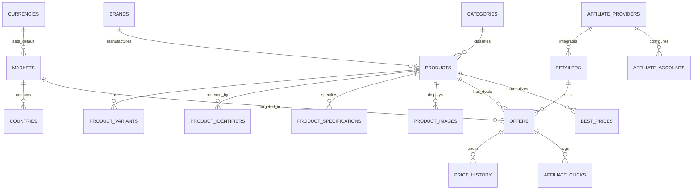

# ARIKARTECH Database Architecture

## 1. Relational Schema Design
The ARIKARTECH database is modeled for multi-market price discovery, canonical product matching, and fast lookups on shared hosting without expensive runtime table scans.

---

## 2. Table Specifications

### Taxonomy & Locales
- `currencies`: Currency codes (`USD`, `GBP`, `EUR`), exchange rates, symbol, and decimals.
- `markets`: Target regional markets (`us`, `uk`, `de`, `fr`, `es`, `it`, `au`, `nz`), hreflang codes, default currency, and active status flag.
- `countries`: ISO-2 and ISO-3 country mappings.
- `categories`: Hardware taxonomy with recursive parent-child hierarchy and display ordering.
- `brands`: Hardware manufacturers (Apple, AMD, NVIDIA, Intel, Asus, Corsair).

### Canonical Products & Identifiers
- `products`: Canonical entity representing a physical technology model.
- `product_variants`: Configurations (color, RAM, storage, SKU).
- `product_specifications`: Key-value technical specifications grouped by category (Processor, Display, Memory).
- `product_identifiers`: **Unique index on `[type, normalized_value]`** covering UPC, EAN, GTIN, ASIN, and MPN for O(1) matching during automated ingestion.
- `product_images`: Primary and gallery images.

### Retailers & Offers
- `affiliate_providers`: Connector drivers (`amazon`, `awin`, `cj`, `impact`, `direct`), encrypted API parameters, rate limits, and connection status.
- `affiliate_accounts`: Market-specific store tracking tags (e.g. Amazon US vs Amazon UK Associate IDs).
- `retailers`: Verified tech merchants (Amazon, Best Buy, B&H Photo, Newegg).
- `offers`: Retailer pricing, availability (`in_stock`, `out_of_stock`, `preorder`), condition (`new`, `refurbished`), and direct destination URLs.
- `price_history`: Immutable time-series snapshots of price shifts for historical charts and deal alerts.
- `best_prices`: **Materialized cache table** with unique constraint on `[product_id, market_id]` storing `min_price`, `max_price`, `best_offer_id`, `offer_count`, and `in_stock_offer_count`.

### Analytics & Operations
- `affiliate_clicks`: Audit trail of outbound referrals with SHA256 hashed IPs for anti-fraud privacy.
- `automation_jobs`: Telemetry logs for CPU-safe batch execution, peak memory, runtime ms, and item counts.
- `audit_logs`: Audit trail for admin mutations.
- `redirects`: Custom 301/302 URL redirects.
