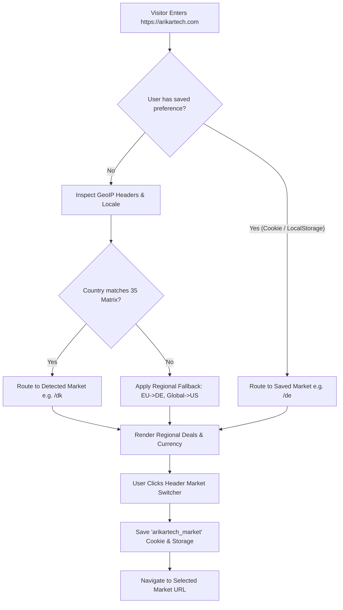

# ARIKARTECH — GLOBAL MARKET ROUTING & GEOLOCATION ARCHITECTURE

## 1. Overview
ARIKARTECH implements an intelligent, SEO-safe, multi-market routing engine across **35 locked regional technology markets**.

---

## 2. Market Routing Lifecycle

---

## 3. Geolocation & Header Detection Hierarchy

The Laravel API endpoint `GET /api/v1/markets/detect` and client-side router (`public/lib/market-router.ts`) resolve visitor country using the following strict priority:

1. **Explicit Query Parameter** (e.g. `?country=DK` for testing).
2. **Cloudflare IP Geolocation Header**: `CF-IPCountry: DK`.
3. **AWS CloudFront Header**: `CloudFront-Viewer-Country: DK`.
4. **Reverse Proxy Headers**: `X-Country-Code: DK`, `GEOIP_COUNTRY_CODE: DK`, `X-Geo-Country: DK`.
5. **Browser Accept-Language**: `Accept-Language: da-DK,da;q=0.9` -> `DK` -> `dk`.
6. **Regional Fallbacks**:
   - European Union / EEA countries -> `de` (Germany) or `gb` (United Kingdom).
   - Canada -> `ca`.
   - Australia -> `au`.
   - New Zealand -> `nz`.
   - Asia / Americas / International -> `us` (United States).

---

## 4. Preference Persistence & User Choice

- **Cookie**: `arikartech_market=<marketCode>; path=/; max-age=31536000; SameSite=Lax`
- **LocalStorage**: `arikartech_market = <marketCode>`
- **Rule**: Explicit user selection via the Market Switcher ALWAYS permanently overrides GeoIP detection. If a user physically in Denmark manually selects US, the site preserves the US market experience for all future visits.

---

## 5. SEO & Crawler Safeguard

- **Search Engine Crawlers (Googlebot, Bingbot, etc.)**:
  - NEVER redirected from specific market URLs (`/de/...`, `/dk/...`, `/gb/...`).
  - Direct crawl access to all 35 market page variants.
- **Canonical URLs**: Each page emits its self-referencing canonical URL (e.g., `https://arikartech.com/de/products/logitech-m170-wireless-mouse`).
- **Hreflang Annotations**: All 35 active regional markets plus `x-default` (`/gb/...` or `/us/...`) are included in `<head>` meta tags and XML sitemaps.
- **Indexation Quality Gate**: Market pages with zero active store offers emit `noindex, follow` to prevent thin page penalties.
